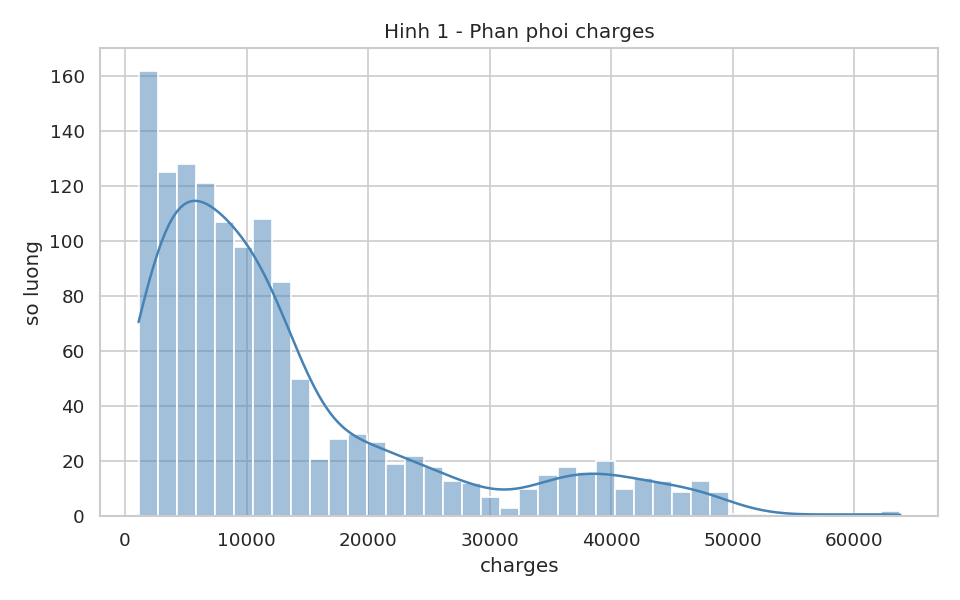
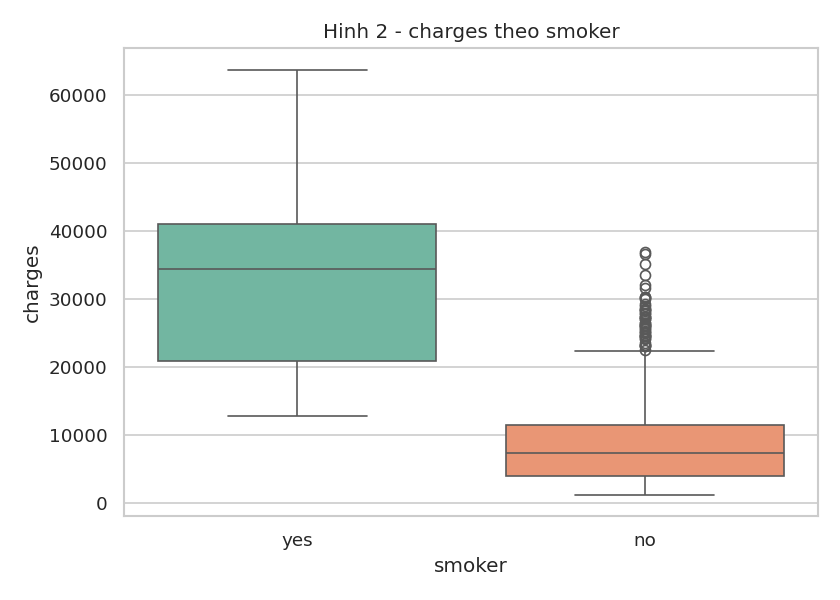
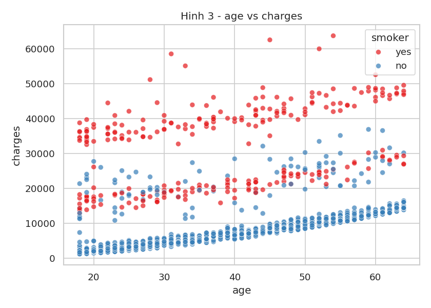
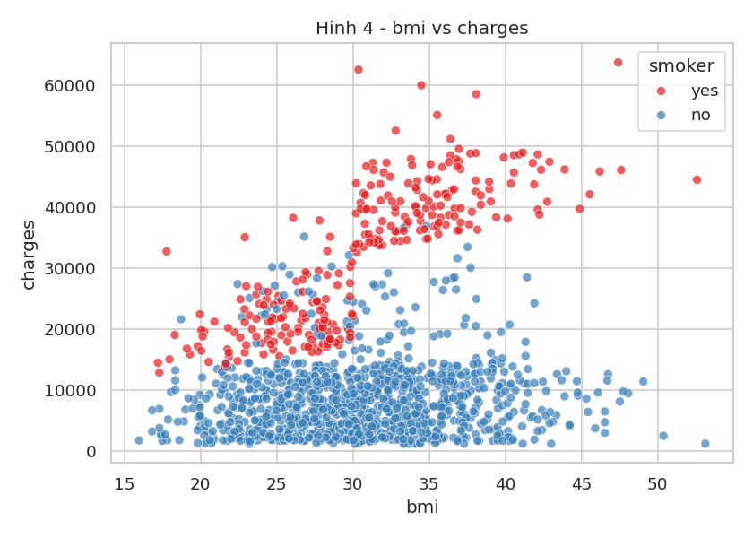
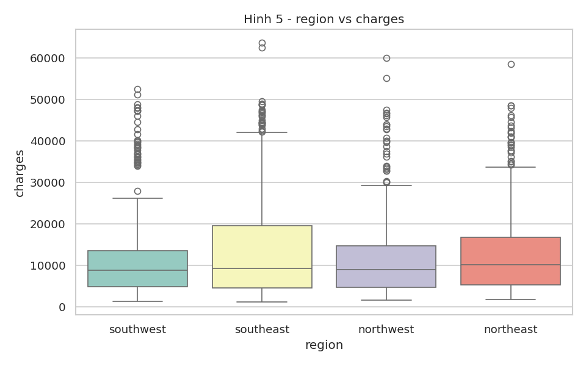
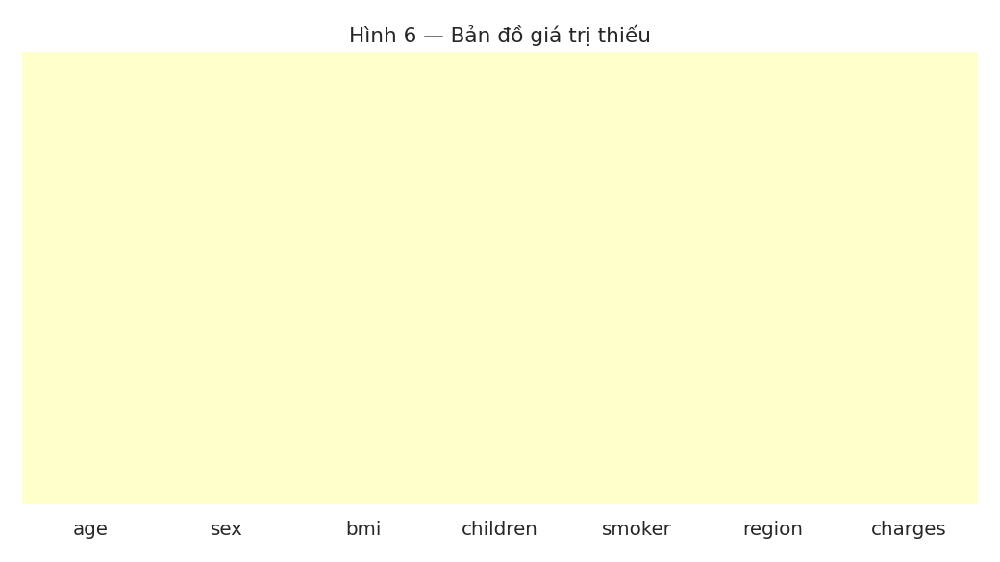
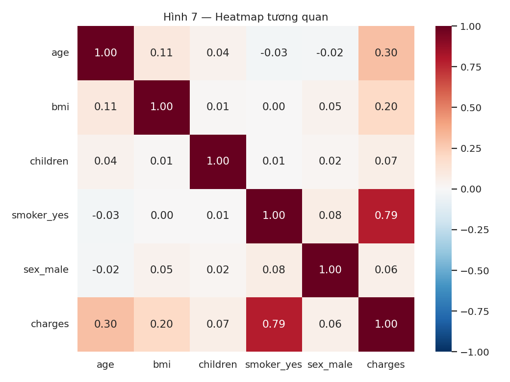
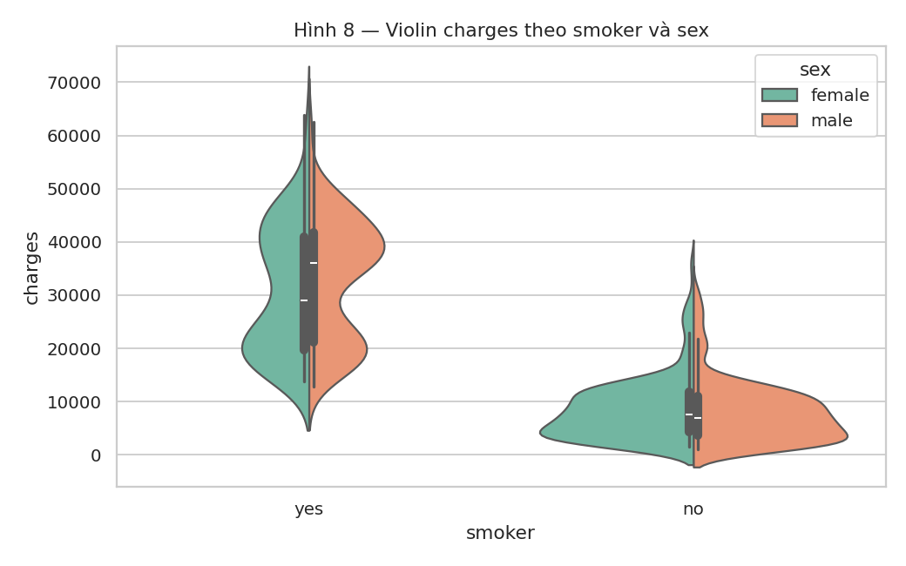
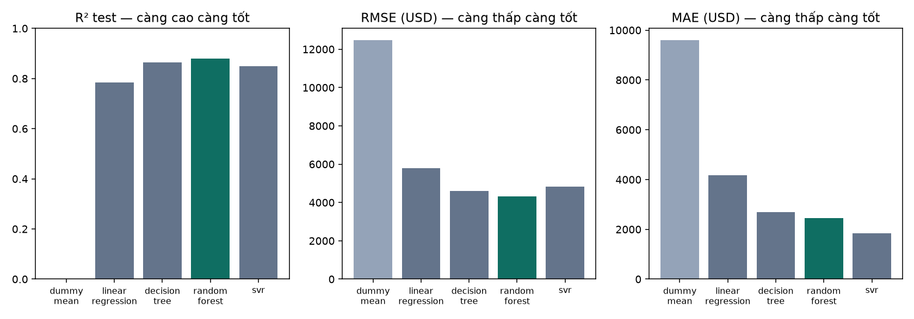

# Giải thích hình EDA

Mỗi hình: (1) cho thấy gì, (2) ý nghĩa với bài toán, (3) quyết định xử lý.

## Hình 1. Phân phối biến mục tiêu charges

1. **Hình cho thấy gì?** Histogram lệch phải: median ~9.4k USD, mean ~13.3k, max ~63.8k. Đuôi dài là nhóm chi phí rất cao.
2. **Ý nghĩa với bài toán?** Hồi quy, target không chuẩn-Gauss. MAE dễ đọc theo USD; RMSE phạt mạnh các ca đắt.
3. **Quyết định xử lý tiếp theo?** Giữ đơn vị USD cho app (không bắt buộc log). Đánh giá bằng MAE + RMSE + R², không chỉ R².

## Hình 2. Boxplot smoker vs charges

1. **Hình cho thấy gì?** `smoker=yes` có median charges cao gấp khoảng 3–4 lần `smoker=no`; hai phân phối gần như tách nhóm.
2. **Ý nghĩa với bài toán?** `smoker` là đặc trưng phân biệt mạnh nhất. Linear Regression dễ underfit nhóm hút thuốc.
3. **Quyết định xử lý tiếp theo?** One-hot `smoker`. Không loại outlier của nhóm hút thuốc — đó là tín hiệu thật.

## Hình 3. Scatter age vs charges (tô smoker)

1. **Hình cho thấy gì?** charges tăng theo age gần như 3 dải song song; dải trên hầu hết là `smoker=yes`.
2. **Ý nghĩa với bài toán?** Có tương tác age × smoker, không chỉ một đường thẳng.
3. **Quyết định xử lý tiếp theo?** Dùng cây/ensemble để bắt tương tác; Linear Regression làm baseline.

## Hình 4. Scatter bmi vs charges (tô smoker)

1. **Hình cho thấy gì?** Với `smoker=yes`, BMI > ~30 đi kèm charges nhảy vọt. Với `smoker=no`, BMI gần như phẳng.
2. **Ý nghĩa với bài toán?** Tương tác bmi × smoker rõ, phi tuyến.
3. **Quyết định xử lý tiếp theo?** Không cắt BMI cao. Cây sẽ tách nhánh smoker rồi mới tách BMI.

## Hình 5. Boxplot region vs charges

1. **Hình cho thấy gì?** Bốn vùng có median gần nhau; southeast hơi rộng hơn, không có vùng ngoại lai hệ thống.
2. **Ý nghĩa với bài toán?** `region` đóng góp yếu hơn smoker/age/bmi nhưng vẫn hợp lệ.
3. **Quyết định xử lý tiếp theo?** One-hot region, `handle_unknown=ignore`. Không gộp vùng.

## Hình 6. Bản đồ giá trị thiếu

1. **Hình cho thấy gì?** Không có ô thiếu (0%). Có 1 dòng trùng / 1338 bản ghi.
2. **Ý nghĩa với bài toán?** Dữ liệu đáng tin, không cần quy tắc điền phức tạp.
3. **Quyết định xử lý tiếp theo?** Vẫn gắn `SimpleImputer` trong pipeline để API không gãy. Giữ duplicate để khớp số dòng Kaggle.

## Hình 7. Heatmap tương quan

1. **Hình cho thấy gì?** `smoker_yes` tương quan mạnh nhất với charges (~0.79). age ~0.30, bmi ~0.20, children/sex yếu.
2. **Ý nghĩa với bài toán?** Không có cặp numeric trùng thông tin nặng. smoker áp đảo.
3. **Quyết định xử lý tiếp theo?** Giữ đủ 6 cột, không PCA. StandardScaler cho numeric vì SVR dùng khoảng cách.

## Hình 8. Violin charges theo smoker và sex

1. **Hình cho thấy gì?** Phân phối `smoker=yes` lệch lên ở cả hai giới; `sex` gần như không tách nhóm trong từng smoker.
2. **Ý nghĩa với bài toán?** sex là đặc trưng yếu; chi phí cao chủ yếu do hút thuốc chứ không phải giới tính.
3. **Quyết định xử lý tiếp theo?** Vẫn one-hot sex theo schema gốc. Phân tích lỗi tập trung nhóm smoker.

## Hình 9. So sánh 4 model + baseline

1. **Hình cho thấy gì?** Dummy R² ≈ 0. Linear 0.78. Tree 0.86. SVR MAE thấp nhất. Random Forest R²/RMSE tốt nhất.
2. **Ý nghĩa với bài toán?** Cả 4 model đều hơn baseline. RF cân bằng accuracy và độ ổn định train–test.
3. **Quyết định xử lý tiếp theo?** Đóng gói RF thành `ai-models/models/model.joblib` (pipeline + model) để AI Service nạp lúc start.
